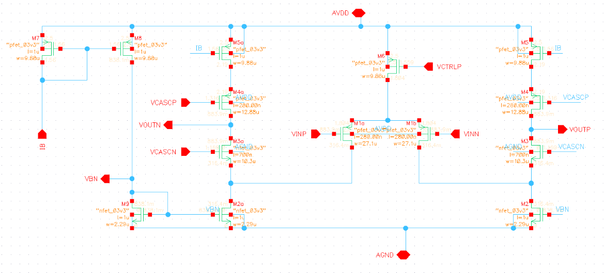
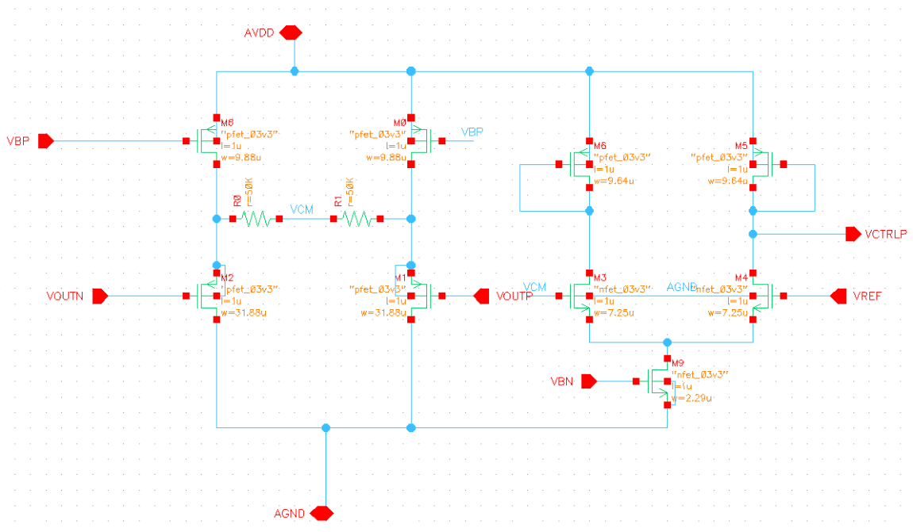

# Two-Stage Miller OTA Rebort 
this is Fully-Differential Folded Cascode OTA mini project we use cadence&Virtuoso amd ADT to analysis and design the circuit and the lab has six parts
in this lab we
- Learn how to generate and use gm/ID design curves.
- Learn how to design a fully-differential folded-cascode OTA achieving given specifications.
- Learn how to simulate the open-loop characteristics of the fully-differential folded-cascode OTA.
- Learn how to simulate the closed-loop characteristics of the fully-differential folded-cascode OTA.
- Learn how to design the common-mode feedback circuit for the OTA.

## part 1 gm/ID Design Charts
In Part 1 we used ADT to generate MOSFET charactaristic chart and learned
- How to generate and use gm/ID design curves.

## part 2 OTA Design
In Part 2 we used Knowledge to design fully-differential folded cascode OTA and learned
- How to design a fully-differential folded cascode OTA meeting desired specifications.
and this is screenshot of the design 

## part 3 Open-Loop OTA Simulation (Behavioral CMFB)
In Part 3 we used cadence&Virtuoso to simulate our Open-Loop OTA (Behavioral CMFB) and learned 
- How to set the CM output voltage of a fully-differential OTA with an ideal CMFB circuit.
- How to simulate the small-signal differential characteristics of a fully-differential folded cascode OTA in open-loop configuration with an ideal CMFB circuit.
and this is screenshot of the behavioral OTA 

## part 4 Open-Loop OTA Simulation (Actual CMFB)
In Part 4 we used cadence&Virtuoso to simulate our Open-Loop OTA Simulation (Actual CMFB) and learned 
- How to design a CMFB circuit.
- How to set the CM output voltage of a fully-differential OTA with an actual CMFB circuit.
- How to simulate the small-signal differential characteristics of a fully-differential folded cascode OTA in open-loop configuration with a real CMFB circuit.
and this is screenshot of the Actual CMFB 

## part 5 Closed Loop Simulation (AC and STB Analysis)
In Part 5 we used cadence&Virtuoso to simulate our closed-Loop OTA and learned 
- How to simulate the small-signal differential gain of a fully-differential folded cascode OTA in closed-loop configuration with a real CMFB circuit.
- How to simulate the stability of both the main OTA loop and the CMFB loop of a fully-differential folded cascode OTA in closed-loop configuration.

## part 6 Closed Loop Simulation (Transient Analysis)
In Part 5 we used cadence&Virtuoso to simulate transient analysis on our closed-Loop OTA and learned 
- How to simulate the stability of both the main OTA loop and the CMFB loop of a fully-differential folded cascode OTA using transient simulation.
- How to simulate the output swing of both the main OTA loop and the CMFB loop of a fully-differential folded cascode OTA using transient simulation.

