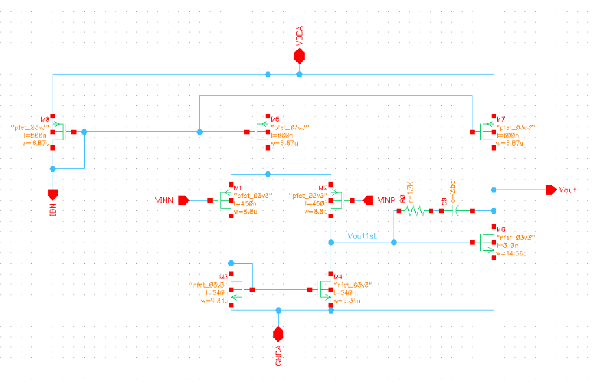
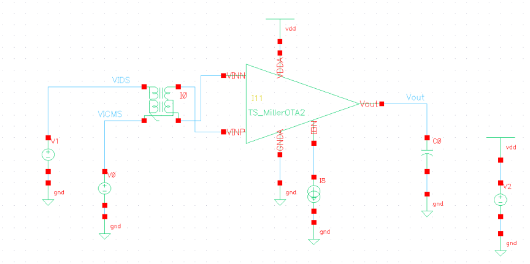
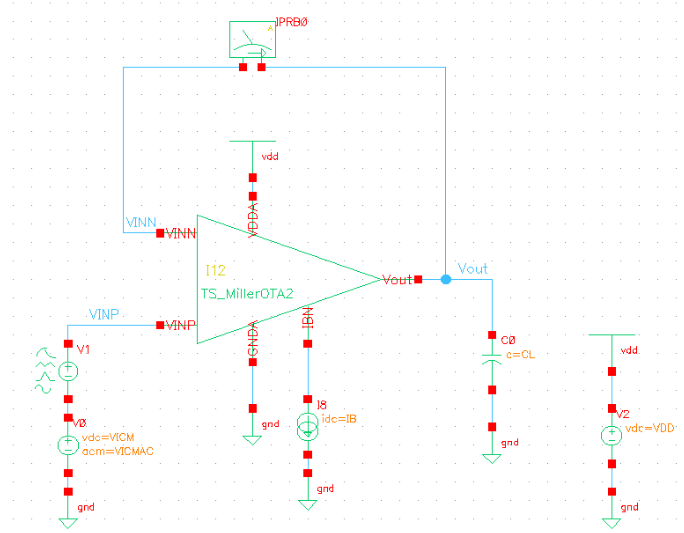
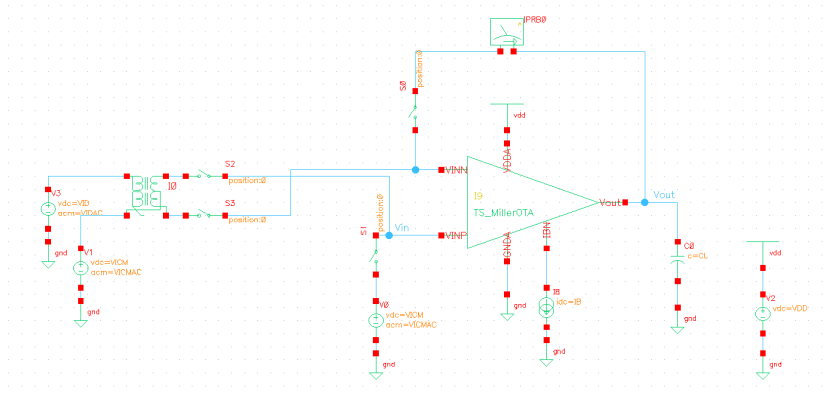
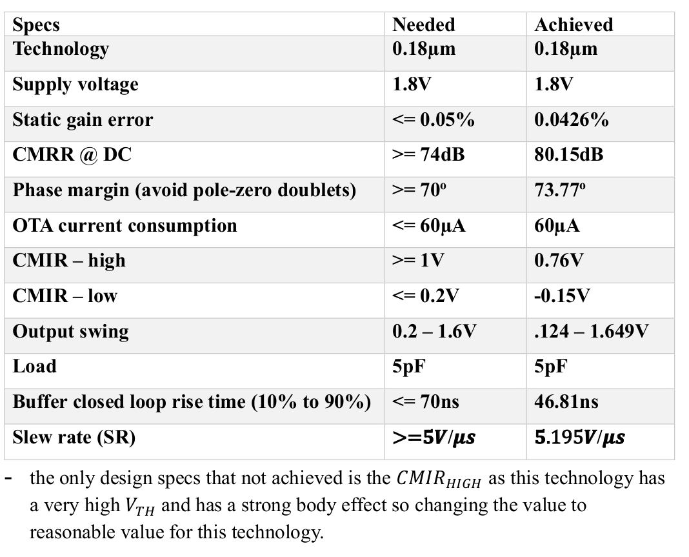

# Two-Stage Miller OTA Rebort 
this is Two-Stage Miller OTA mini project we use cadence&Virtuoso amd ADT to analysis and design the circuit and the lab has five parts
in this lab we
- Learn how to generate and use gm/ID design curves.
- Learn how to design a two-stage Miller OTA achieving given specifications.
- Learn how to simulate the open-loop characteristics of the two-stage Miller OTA.
- Learn how to simulate the closed-loop characteristics of the two-stage Miller OTA.

## part 1 gm/ID Design Charts
In Part 1 we used ADT to generate MOSFET charactaristic chart and learned
- How to generate and use gm/ID design curves.

## part 2 OTA Design
In Part 2 we used Knowledge to design Two-Stage Miller OTA and learned
- How to design two-stage Miller OTA meeting desired specifications.
and this is screenshot of the design 

## part 3 Open-Loop OTA Simulation
In Part 3 we used cadence&Virtuoso to simulate our Open-Loop OTA and learned 
- How to simulate the small-signal differential gain of two-stage Miller OTA in open-loop configuration.
- How to simulate the small-signal common-mode gain of two-stage Miller OTA in open-loop configuration.
- How to simulate the large-signal differential characteristics of two-stage Miller OTA in open-loop configuration.
- How to simulate the large-signal common-mode characteristics of two-stage Miller OTA in open-loop configuration.
and this is screenshot of the Open-Loop OTA 

## part 4 Closed-Loop OTA Simulation
In Part 4 we used cadence&Virtuoso to simulate our closed-Loop OTA and learned 
- How to simulate the small-signal differential gain of two-stage Miller OTA in closed-loop configuration.
- How to simulate the small-signal common-mode gain of two-stage Miller OTA in closed-loop configuration.
- How to simulate the large-signal differential characteristics of two-stage Miller OTA in closed-loop configuration.
- How to simulate the large-signal common-mode characteristics of two-stage Miller OTA in closed-loop configuration.
and this is screenshot of the Closed-Loop OTA 

## part 5 (optional): DC Closed Loop AC Open-Loop OTA Simulation
In Part 5 we used cadence&Virtuoso to simulate our closed-Loop OTA and learned 
- How to use dc closed-loop configuration to simulate an ac open-loop configuration.
and this is screenshot of the DC Closed Loop AC Open-Loop OTA 

and in the final of the labs simulation this the resulat we get from this design 

